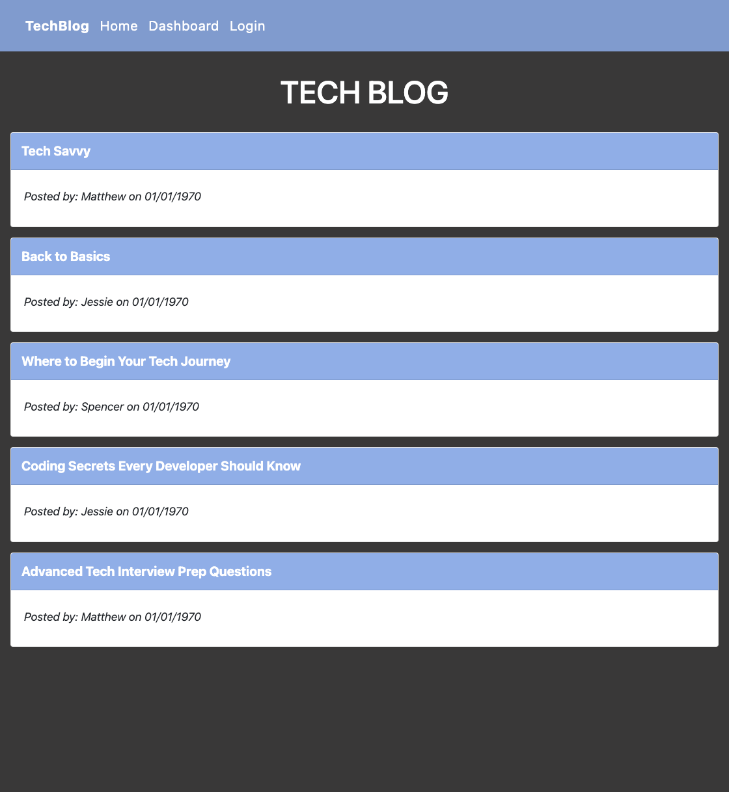

# Tech Blog

## Description

This application is a CMS-style blog site similar to a Wordpress site, where developers can publish their blog posts and comment on other developers’ posts as well. The app follows the MVC paradigm in its architectural structure, using Handlebars.js as the templating language, Sequelize as the ORM, and the express-session npm package for authentication.

This can be a useful platform for developers to publish articles, blog posts, along with their thoughts and opinions about tech. 

## Usage

* When a user visits the site for the first time, they are presented with the homepage, which includes existing blog posts if any have been posted; navigation links for the homepage and the dashboard; and the option to log in.
* When homepage option is clicked, the user is taken to the homepage.
* When any other links are clicked in the navigation bar, the user is prompted to either sign up or sign in.
* When the user chooses to sign up, they are prompted to create a username and password.
* When the sign-up button is clicked, the user's credentials are saved and they are logged into the site.
* When the user revists the site at a later time and chooses to sign in, they are prompted to enter their username and password.
* When the user is signed in to the site, they will see navigation links for the homepage, the dashboard, and the option to log out.
* When the user clicks on the homepage option in the navigation, they are taken to the homepage and presented with existing blog posts that include the post title and the date created.
* When the user clicks on an existing blog post, they are presented with the post title, contents, post creator’s username, and date created for that post and have the option to leave a comment.
* When the user enters a comment and clicks on the submit button while signed in, the comment is saved and the post is updated to display the comment, the comment creator’s username, and the date created.
* When the user clicks on the dashboard option in the navigation, they are taken to the dashboard and presented with any blog posts they have already created and the option to add a new blog post.
* When the user clicks on the button to add a new blog post, they are prompted to enter both a title and contents for their blog post.
***** When the user clicks on the button to create a new blog post, then the title and contents of their post are saved and they are taken back to an updated dashboard with their new blog post.
* When the user clicks on one of their existing posts in the dashboard, they are able to delete or update their post and are taken back to an updated dashboard.
* When the user clicks on the logout option in the navigation, they are signed out of the site.
* When the user is idle on the site for more than a set time, then they are able to view comments but are prompted to log in again before they can add, update, or delete comments.

## Mock-Up
Screenshot of the application:

 

## Technologies Used
* Bootstrap
* Bcrypt
* Heroku
* Node.js
* Connect-session-sequelize
* Dotenv
* Express
* Express-handlebars
* Express-session
* Handlebars
* Handlebars.moment
* MySql2
* Sequelize

## Links
* View the application: https://tech-blog-333.herokuapp.com/
* GitHub repository: https://github.com/mich-hales/Tech-Blog
